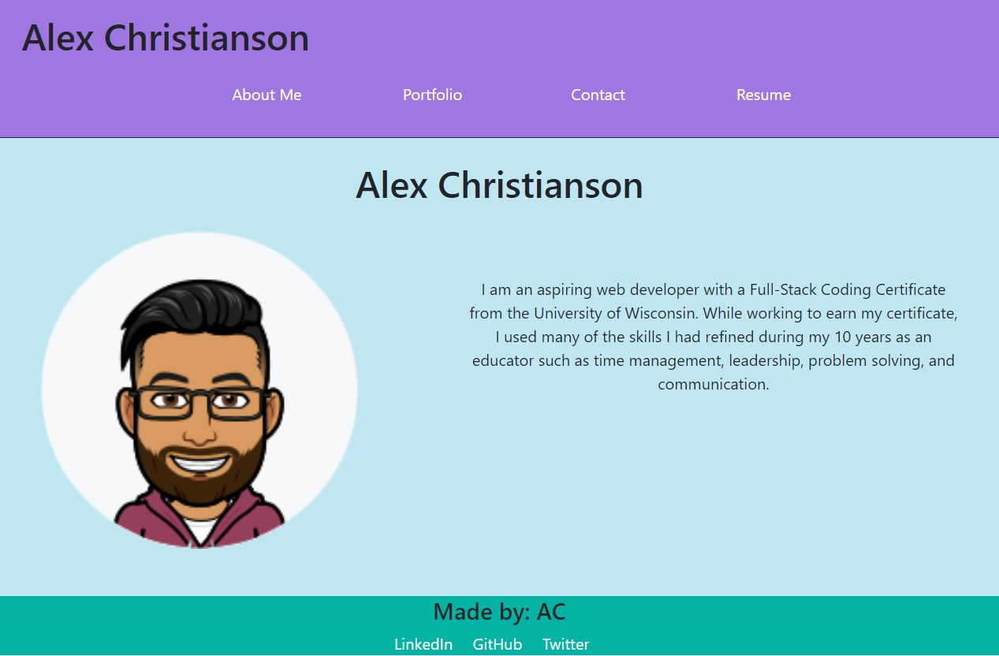

# react-portfolio

## Description 
This is my portfolio created using React.js. It contains a short bio about me, a portfolio that displays some of the projects I have completed along with links to the deployed page and repository, a contact section, and a resume section which lists some of my coding skills along with a link to my resume.

Link to deployed application: :link: https://alexchristianson.github.io/react-portfolio/

## Screenshot

## Table of Contents
* [License](#license)
* [Questions](#questions)

## License
🔗https://opensource.org/licenses/MIT

## Questions
Please reach out via email or GitHub with questions or issues.

🔗https://github.com/alexchristianson

📧alex.christianson.05@gmail.com
